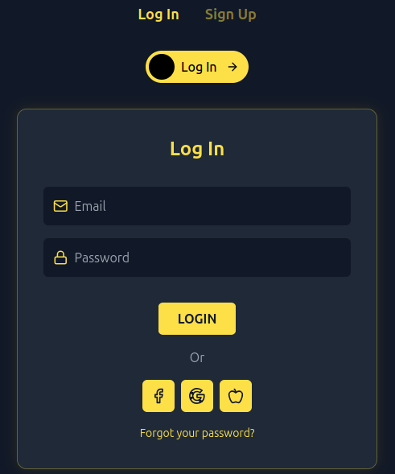

# Login Flip Card

A modern 3D flip animation login/signup card component built with React, Vite, and Tailwind CSS.



## Features

- Smooth 3D card flip animation between login and signup forms
- Interactive toggle switch with animation
- Responsive design with dark theme
- Social login integration (Facebook, Google, Apple)
- Clean UI with form validation indicators
- Modular component architecture using Screaming Architecture

## Tech Stack

- **React** - UI library
- **Vite** - Build tool
- **Tailwind CSS** - Utility-first CSS framework
- **Lucide React** - Icon library

## Project Structure

The project follows a Screaming Architecture pattern, organizing components by feature/domain rather than by type:

```
login-flip-card/
├── public/
│   ├── index.html
│   └── favicon.ico
├── src/
│   ├── components/
│   │   ├── Login/
│   │   │   ├── LoginForm.jsx
│   │   │   └── SocialLoginButtons.jsx
│   │   ├── Signup/
│   │   │   └── SignupForm.jsx
│   │   ├── UI/
│   │   │   ├── FlipCard/
│   │   │   │   └── FlipCard.jsx
│   │   │   └── ToggleSwitch/
│   │   │       └── ToggleSwitch.jsx
│   │   └── Navigation/
│   │       └── TabNavigation.jsx
│   ├── pages/
│   │   └── AuthPage.jsx
│   ├── App.jsx
│   ├── main.jsx
│   └── index.css
├── tailwind.config.js
├── postcss.config.js
├── package.json
├── README.md
└── .gitignore
```

## Installation

1. Clone the repository
```bash
git clone https://github.com/yourusername/login-flip-card.git
cd login-flip-card
```

2. Install dependencies
```bash
npm install
```

3. Start the development server
```bash
npm run dev
```

4. Open your browser and navigate to http://localhost:5173

## Building for Production

To create a production build:

```bash
npm run build
```

The build artifacts will be stored in the `dist/` directory.

## Customization

### Styling

The component uses Tailwind CSS for styling. You can customize colors, sizes, and other design elements by:

1. Modifying the Tailwind classes in the component files
2. Extending the theme in `tailwind.config.js`

### Form Fields

You can easily add or remove form fields by modifying the appropriate form components:

- `src/components/Login/LoginForm.jsx`
- `src/components/Signup/SignupForm.jsx`

### Toggle Switch

The toggle animation can be adjusted in:

- `src/components/UI/ToggleSwitch/ToggleSwitch.jsx`

## Contributing

Contributions are welcome! Please feel free to submit a Pull Request.

1. Fork the repository
2. Create your feature branch (`git checkout -b feature/amazing-feature`)
3. Commit your changes (`git commit -m 'Add some amazing feature'`)
4. Push to the branch (`git push origin feature/amazing-feature`)
5. Open a Pull Request

## Inspiration
This project was inspired by various login/signup card designs found on the web, including [this CodePen example] https://codepen.io/ig_design/full/KKVQpVP.

## Acknowledgments

- Design inspiration from modern authentication interfaces
- [React](https://reactjs.org/)
- [Vite](https://vitejs.dev/)
- [Tailwind CSS](https://tailwindcss.com/)
- [Lucide React](https://lucide.dev/)
